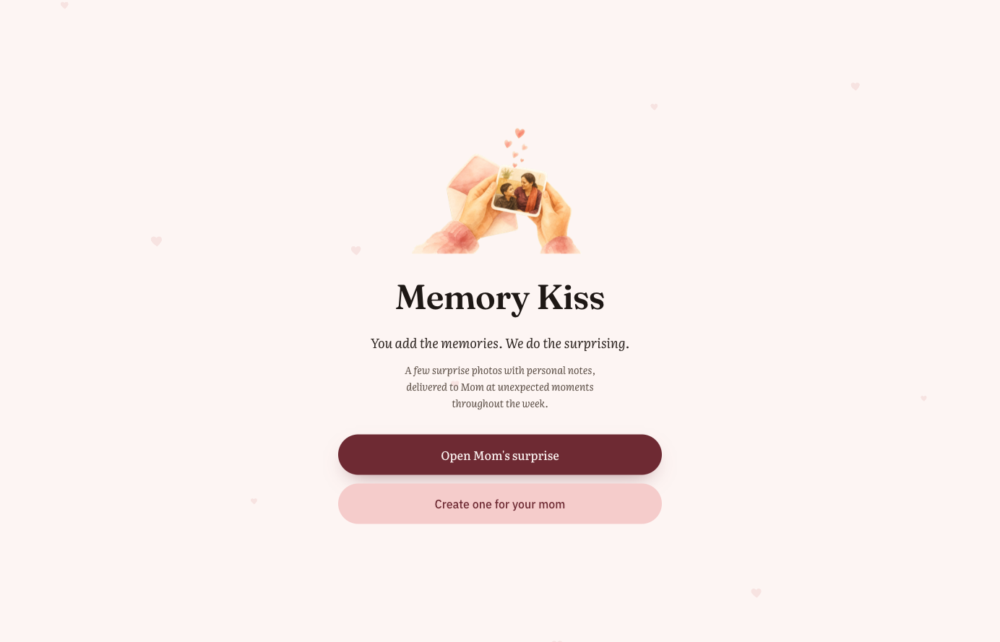
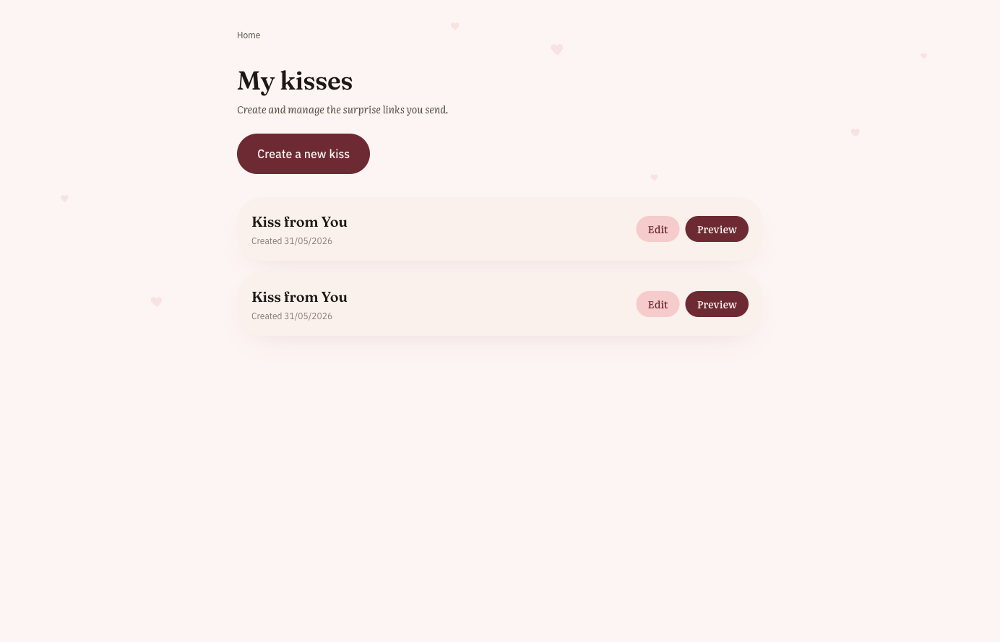
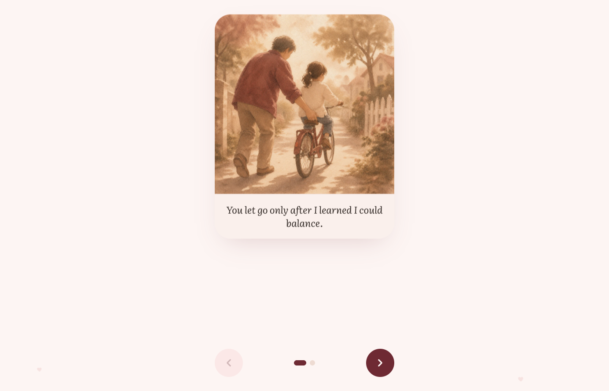

# Memory Kiss

Memory Kiss is a small photo surprise app for sharing personal memories with someone you love. It lets you create a private link, add photos and captions, and send the reveal page as a simple emotional gift.

The app works locally without a backend by storing created kisses in browser local storage. To share links across devices, connect a Supabase project.

## Screenshots







## Tech Stack

- React 19
- TanStack Router and TanStack Start
- Vite
- Tailwind CSS
- Supabase for optional persistence and photo storage
- Cloudflare Workers deployment support

## Getting Started

Install dependencies:

```bash
npm install
```

Start the dev server:

```bash
npm run dev
```

Build for production:

```bash
npm run build
```

Run verification:

```bash
npm run lint
npm run typecheck
npm run build
npm run audit
```

## Supabase Setup

Supabase is optional for local demos. Without environment variables, Memory Kiss falls back to browser local storage and does not require sign-in.

To enable authenticated creator accounts and shared links across devices:

1. Create a Supabase project.
2. Run `supabase/schema.sql` in the Supabase SQL editor.
3. Copy `.env.example` to `.env.local`.
4. Set these values:

```bash
VITE_SUPABASE_URL=your-project-url
VITE_SUPABASE_ANON_KEY=your-publishable-key
```

The included schema uses Supabase Auth. Creators sign in with an email magic link, own their kisses and memories through row-level security, and recipients can open public reveal links without an account.

In your Supabase dashboard, enable email sign-in and add your deployed app URL to the auth redirect URL allow list.

The photo bucket is public in this v1 setup so reveal links can render uploaded photos directly. Do not use it for highly sensitive photos without moving to a private bucket and signed URLs.

## Deployment

This project includes `wrangler.jsonc` for Cloudflare Workers.

```bash
npm run build
npx wrangler deploy
```

Set `VITE_SUPABASE_URL` and `VITE_SUPABASE_ANON_KEY` in your deployment environment when using Supabase-backed auth and persistence.

## Architecture

See `docs/architecture.md` for the data model, authentication model, and privacy tradeoffs.

## Sample Images

The demo reveal uses generated sample images from `public/samples/`.

Want to generate your own images in the same style? Use the prompts in `docs/sample-image-prompts.md`.

## Privacy Notes

Do not commit personal photos or real recipient data to the repository. Demo content should use generic illustrations or synthetic sample assets.

## License

MIT
